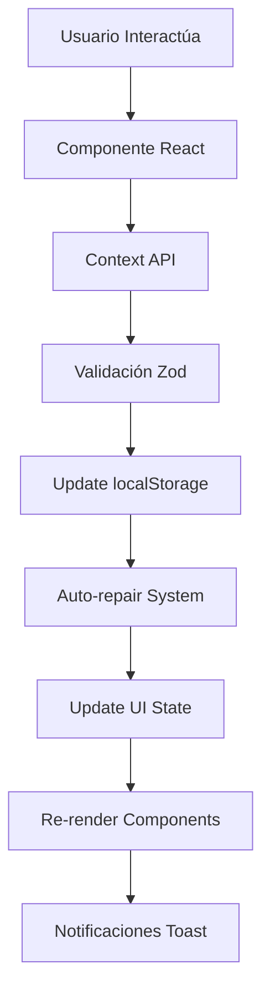
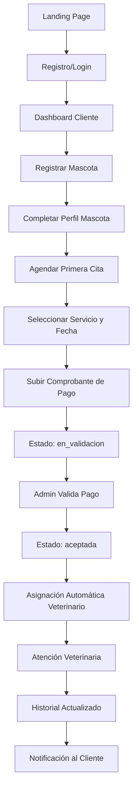
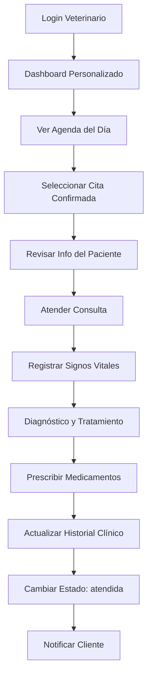
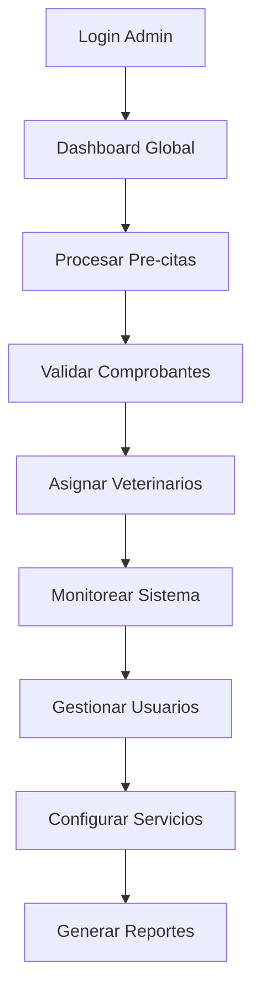
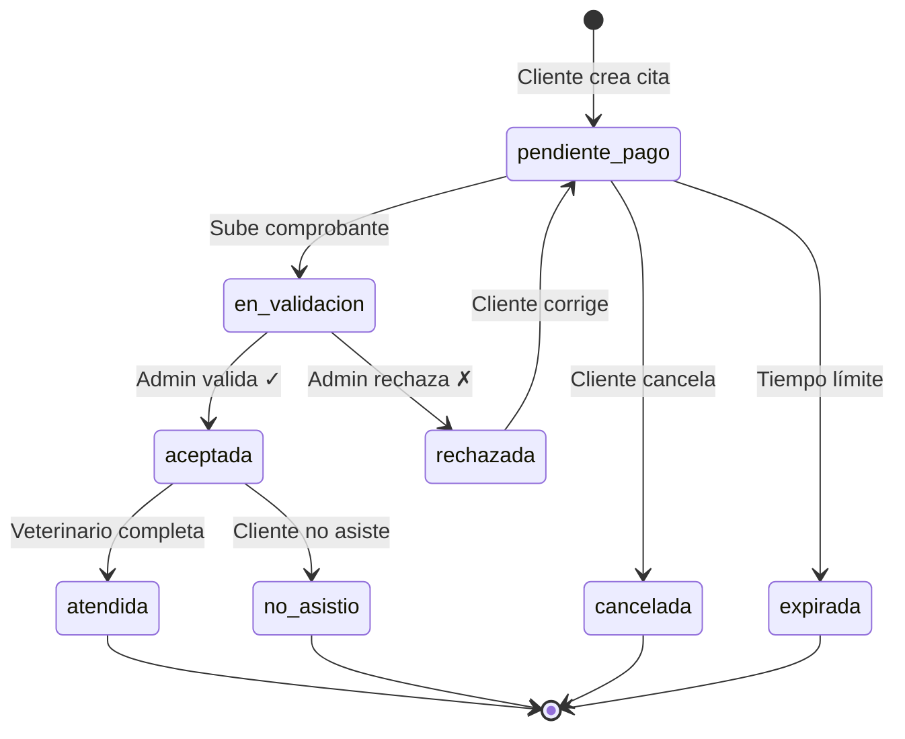

# 🩺 PetLA - Sistema Integral de Gestión Veterinaria

<div align="center">
  
  
  **Plataforma veterinaria completa para la gestión moderna de clínicas**
  
  [](https://reactjs.org/)
  [](https://www.typescriptlang.org/)
  [](https://tailwindcss.com/)
  [](LICENSE)
</div>

---

## 📋 Tabla de Contenidos

1. [🌟 Descripción del Proyecto](#-descripción-del-proyecto)
2. [🏗️ Arquitectura del Sistema](#️-arquitectura-del-sistema)
3. [👥 Roles y Funcionalidades](#-roles-y-funcionalidades)
4. [🔄 Flujos Principales](#-flujos-principales)
5. [📊 Estructura de Datos](#-estructura-de-datos)
6. [🛠️ Stack Tecnológico](#️-stack-tecnológico)
7. [⚙️ Instalación](#️-instalación)
8. [🚀 Funcionalidades Principales](#-funcionalidades-principales)
9. [📱 Responsive Design](#-responsive-design)
10. [🔒 Seguridad](#-seguridad)
11. [🧪 Testing](#-testing)
12. [📄 Documentación Adicional](#-documentación-adicional)

---

## 🌟 Descripción del Proyecto

**PetLA** es una plataforma web completa que digitaliza y optimiza todos los procesos de una clínica veterinaria moderna. Conecta eficientemente a propietarios de mascotas, veterinarios y administradores en un ecosistema digital integral.

### 🎯 Propósito Principal

Transformar la experiencia veterinaria tradicional mediante tecnología que:

- **Simplifica** el agendamiento de citas para propietarios de mascotas
- **Optimiza** la gestión de pacientes para veterinarios
- **Automatiza** procesos administrativos para el personal
- **Centraliza** información médica en historiales digitales

### 🏥 Casos de Uso Principales

- **Sistema de Citas Inteligente**: Agendamiento con validación automática de pagos
- **Historial Clínico Digital**: Registro completo de consultas veterinarias
- **Dashboard Personalizado**: Métricas específicas por rol de usuario
- **Gestión de Pagos**: Validación digital de comprobantes
- **Sistema de Notificaciones**: Comunicación en tiempo real

---

## 🏗️ Arquitectura del Sistema

### 📦 Stack Tecnológico Actual

```typescript
const currentStack = {
  // Frontend Framework
  framework: "React 18.3.1",
  language: "TypeScript 5.5.3",
  buildTool: "Vite 6.2.2",
  routing: "React Router 6.26.2 (SPA)",

  // Estado y Persistencia
  stateManagement: "Context API + localStorage",
  dataStorage: "localStorage (auto-repair system)",

  // UI y Styling
  styling: "TailwindCSS 3.4.11",
  components: "Radix UI Primitives (42+ components)",
  icons: "Lucide React 0.462.0",
  animations: "Framer Motion 12.6.2",

  // Formularios y Validación
  forms: "React Hook Form 7.53.0",
  validation: "Zod 3.23.8",

  // Testing y Desarrollo
  testing: "Vitest 3.1.4",
  typeChecking: "TypeScript strict mode",
};
```

### 🗂️ Estructura del Proyecto

```
src/
├── components/              # Componentes reutilizables
│   ├── ui/                 # 42+ componentes UI (Radix UI)
│   │   ├── button.tsx      # Botones con variantes
│   │   ├── card.tsx        # Cards y containers
│   │   ├── dialog.tsx      # Modales y dialogs
│   │   ├── table.tsx       # Tablas responsivas
│   │   └── ...             # Más componentes
│   ├── Layout.tsx          # Layout principal con navegación
│   ├── AuthLayout.tsx      # Layout para autenticación
│   ├── ProtectedRoute.tsx  # Protección de rutas por rol
│   ├── CitaDetailModal.tsx # Modal de detalles de cita
│   ├── CitaAttendModal.tsx # Modal para atender citas
│   └── ConfirmationModal.tsx # Modal de confirmación
├── contexts/               # Estado global
│   └── AppContext.tsx      # Context principal (1200+ líneas)
├── hooks/                  # React hooks personalizados
│   ├── useConfirmation.tsx # Hook para confirmaciones
│   ├── useNotificationToast.tsx # Gestión de toast notifications
│   └── use-mobile.tsx      # Detección de dispositivos móviles
├── lib/                    # Lógica de negocio y utilidades
│   ├── types.ts            # Definiciones TypeScript completas
│   ├── utils.ts            # Utilidades generales (cn, formatters)
│   ├── citaUtils.ts        # Utilidades específicas de citas
│   └── imageUtils.ts       # Compresión automática de imágenes
├── pages/                  # Páginas de la aplicación (28 páginas)
│   ├── Index.tsx           # Landing page pública
│   ├── Login.tsx           # Autenticación
│   ├── Dashboard.tsx       # Dashboard universal por roles
│   ├── DashboardVeterinario.tsx # Dashboard específico veterinario
│   │
│   ├── # PÁGINAS DEL CLIENTE
│   ├── MisMascotas.tsx     # Gestión de mascotas
│   ├── MisCitas.tsx        # Gestión de citas del cliente
│   ├── NuevaCita.tsx       # Agendar nueva cita
│   ├── HistorialClinico.tsx # Historial médico de mascotas
│   │
│   ├── # PÁGINAS DEL VETERINARIO
│   ├── Calendario.tsx      # Agenda médica
│   ├── MisPacientes.tsx    # Gestión de pacientes asignados
│   ├── HistorialClinicoVeterinario.tsx # Historial completo
│   │
│   ├── # PÁGINAS DEL ADMINISTRADOR
│   ├── PreCitas.tsx        # Gestión de solicitudes públicas
│   ├── GestionCitas.tsx    # Gestión completa de citas
│   ├── GestionCitasPago.tsx # Validación de pagos
│   ├── Usuarios.tsx        # Gestión de usuarios
│   ├── Veterinarios.tsx    # Gestión de veterinarios
│   ├���─ GestionNewsletter.tsx # Sistema de newsletter
│   │
│   ├── # PÁGINAS COMUNES
│   ├── Configuracion.tsx   # Configuración de cuenta
│   ├── Notificaciones.tsx  # Centro de notificaciones
│   ├── Privacidad.tsx      # Política de privacidad
│   ├── Terminos.tsx        # Términos de servicio
│   └── ...                 # Más páginas especializadas
└── main.tsx               # Entry point de la aplicación
```

### 🌊 Flujo de Datos



---

## 👥 Roles y Funcionalidades

### 🟦 Cliente (Propietario de Mascotas)

**Funcionalidades principales:**

- ✅ Registro y gestión de mascotas con fotos
- ✅ Agendamiento autónomo de citas médicas
- ✅ Subida y gestión de comprobantes de pago
- ✅ Seguimiento en tiempo real del estado de citas
- ✅ Consulta completa del historial clínico
- ✅ Sistema de notificaciones personalizadas

**Rutas específicas:**

- `/dashboard` - Dashboard personalizado del cliente
- `/mascotas` / `/mis-mascotas` - Gestión de mascotas
- `/mis-citas` - Gestión de citas
- `/nueva-cita` - Agendar nueva cita
- `/historial` - Historial clínico de mascotas

### 🟩 Veterinario

**Funcionalidades principales:**

- ✅ Agenda médica personalizada y optimizada
- ✅ Gestión completa de pacientes asignados
- ✅ Registro detallado de consultas médicas
- ✅ Actualización de historiales clínicos
- ✅ Búsqueda avanzada de pacientes
- ✅ Estadísticas de práctica profesional

**Rutas específicas:**

- `/dashboard` - Dashboard veterinario con métricas
- `/calendario` - Agenda médica interactiva
- `/mis-pacientes` - Lista y gestión de pacientes
- `/historial-clinico-veterinario` - Historial clínico completo

### 🟥 Administrador

**Funcionalidades principales:**

- ✅ Gestión completa de usuarios y veterinarios
- ✅ Validación digital de comprobantes de pago
- ✅ Procesamiento de pre-citas del landing
- ✅ Configuración de servicios y precios
- ✅ Gestión de comunicaciones (newsletter)
- ✅ Estadísticas globales y reportes

**Rutas específicas:**

- `/dashboard` - Dashboard administrativo global
- `/pre-citas` - Gestión de solicitudes públicas
- `/gestion-citas` - Gestión completa de citas
- `/validacion-pagos` - Validación de comprobantes
- `/usuarios` - Gestión de usuarios
- `/veterinarios` - Gestión de veterinarios
- `/gestion-newsletter` - Sistema de newsletter

---

## 🔄 Flujos Principales

### 🎯 Flujo Completo del Cliente



### 🏥 Flujo del Veterinario



### 👨‍💼 Flujo del Administrador



---

## 📊 Estructura de Datos

### 👤 Entidades Principales

**Usuario:**

```typescript
interface Usuario {
  id: string;
  nombre: string;
  apellidos?: string;
  username?: string;
  email: string;
  telefono?: string;
  direccion?: string;
  fechaNacimiento?: Date;
  genero?: string;
  rol: "admin" | "cliente" | "veterinario";
  documento?: string;
  tipoDocumento?: "dni" | "pasaporte" | "carnet_extranjeria" | "cedula";
  especialidad?: string; // Solo veterinarios
  experiencia?: string; // Solo veterinarios
  colegiatura?: string; // Solo veterinarios
  fechaRegistro?: Date;
  foto?: string;
}
```

**Mascota:**

```typescript
interface Mascota {
  id: string;
  nombre: string;
  especie: string;
  raza: string;
  sexo?: string;
  fechaNacimiento: Date;
  peso?: string;
  microchip?: string;
  estado: string;
  clienteId: string; // FK al propietario
  proximaCita?: Date;
  ultimaVacuna?: Date;
  foto?: string; // Base64 comprimido
}
```

**Cita:**

```typescript
interface Cita {
  id: string;
  mascota: string; // Nombre de la mascota
  mascotaId?: string; // ID de la mascota
  especie: string;
  clienteId?: string; // ID del cliente propietario
  clienteNombre?: string; // Nombre del cliente
  fecha: Date;
  estado: EstadoCita;
  veterinario: string;
  motivo: string;
  tipoConsulta: string;
  ubicacion: string;
  precio: number;
  notas?: string;
  comprobantePago?: string;
  comprobanteData?: ComprobanteData;
  notasAdmin?: string;
}

type EstadoCita =
  | "pendiente_pago"
  | "en_validacion"
  | "aceptada"
  | "atendida"
  | "cancelada"
  | "expirada"
  | "rechazada"
  | "no_asistio";
```

### 🔄 Estados de Citas



---

## 🛠️ Stack Tecnológico

### Frontend Actual

**Core Framework:**

- React 18.3.1 con TypeScript 5.5.3
- Vite 6.2.2 para desarrollo y build
- React Router 6.26.2 (Single Page Application)

**Gestión de Estado:**

- Context API para estado global
- localStorage para persistencia
- Sistema de auto-reparación de datos

**UI y Styling:**

- TailwindCSS 3.4.11 (utility-first)
- Radix UI para componentes accesibles
- 42+ componentes UI pre-construidos
- Lucide React para iconografía
- Framer Motion para animaciones

**Formularios y Validación:**

- React Hook Form 7.53.0
- Zod 3.23.8 para validación de schemas
- Validación en tiempo real

**Testing y Calidad:**

- Vitest 3.1.4 para testing
- TypeScript en modo strict
- ESLint + Prettier para calidad de código

### Dependencias Principales

```json
{
  "dependencies": {
    "react": "^18.3.1",
    "react-dom": "^18.3.1",
    "react-router-dom": "^6.26.2",
    "react-hook-form": "^7.53.0",
    "@radix-ui/react-*": "Múltiples componentes",
    "tailwindcss": "^3.4.11",
    "framer-motion": "^12.6.2",
    "lucide-react": "^0.462.0",
    "zod": "^3.23.8",
    "date-fns": "^3.6.0",
    "recharts": "^2.12.7",
    "sonner": "^1.5.0"
  }
}
```

---

## ⚙️ Instalación

### 📋 Prerrequisitos

- Node.js v18.0.0 o superior
- npm v8.0.0 o superior
- Git para clonar el repositorio

### 🚀 Instalación Rápida

```bash
# Clonar el repositorio
git clone https://github.com/tu-usuario/petla.git
cd petla

# Instalar dependencias
npm install

# Iniciar servidor de desarrollo
npm run dev
```

### 📦 Scripts Disponibles

```bash
# Desarrollo
npm run dev              # Servidor de desarrollo (puerto 8080)

# Construcción
npm run build            # Build de producción
npm run preview          # Preview del build

# Testing
npm test                 # Ejecutar tests con Vitest

# Calidad de Código
npm run typecheck        # Verificar tipos TypeScript
npm run format.fix       # Formatear código con Prettier
```

---

## 🚀 Funcionalidades Principales

### 📅 Sistema de Citas Avanzado

**Características:**

- ✅ Agendamiento paso a paso intuitivo
- ✅ Estados automatizados (8 estados diferentes)
- ✅ Validación digital de comprobantes
- ✅ Asignación automática de veterinarios
- ✅ Sistema de notificaciones en tiempo real
- ✅ Gestión de múltiples métodos de pago (YAPE, PLIN, bancos)

**Servicios Disponibles:**

- Consulta General (S/. 80)
- Vacunación (S/. 65)
- Emergencia (S/. 150)
- Grooming (S/. 45)
- Cirugía (S/. 250)
- Diagnóstico (S/. 120)

### 🐕 Gestión de Mascotas

**Funcionalidades:**

- ✅ Registro completo con foto
- ✅ Compresión automática de imágenes
- ✅ Gestión de peso y microchip
- ✅ Seguimiento de vacunas
- ✅ Historial médico integrado

### 🩺 Historial Clínico Digital

**Características:**

- ✅ Registro detallado de consultas
- ✅ Signos vitales completos
- ✅ Diagnóstico y tratamiento
- ✅ Prescripciones médicas
- ✅ Exportación a PDF, Excel y TXT
- ✅ Análisis de tendencias de salud

### 💾 Sistema de Almacenamiento Inteligente

**Características:**

- ✅ Auto-reparación de datos inconsistentes
- ✅ Compresión automática de imágenes
- ✅ Sincronización Context ↔ localStorage
- ✅ Migración automática de versiones de datos
- ✅ Optimización automática de espacio

### 🔍 Búsqueda Avanzada

**Funcionalidades:**

- ✅ Búsqueda fuzzy tolerante a errores
- ✅ Filtros múltiples simultáneos
- ✅ Búsqueda en tiempo real
- ✅ Resultados enriquecidos con contexto

### 📊 Dashboard Inteligente

**Por Rol:**

- **Cliente**: Estadísticas de mascotas, próximas citas, historial
- **Veterinario**: Citas del día, pacientes asignados, estadísticas personales
- **Admin**: Métricas globales, citas pendientes, gestión de usuarios

---

## 📱 Responsive Design

### 📐 Breakpoints

```css
/* TailwindCSS Breakpoints */
sm: 640px     /* Móviles grandes */
md: 768px     /* Tablets */
lg: 1024px    /* Laptops */
xl: 1280px    /* Desktops */
2xl: 1536px   /* Desktops grandes */
```

### 🎨 Caracter��sticas Responsive

- **Navegación adaptiva**: Sidebar en desktop, menú hamburguesa en móvil
- **Tablas inteligentes**: Scroll horizontal en pantallas pequeñas
- **Modales adaptivos**: Fullscreen en móvil, centrados en desktop
- **Formularios optimizados**: Inputs táctiles en dispositivos móviles
- **Imágenes responsivas**: Compresión automática según viewport

---

## 🔒 Seguridad

### 🛡️ Autenticación y Autorización

**Sistema de Roles:**

```typescript
// Protección de rutas por roles
<ProtectedRoute allowedRoles={["admin", "veterinario"]}>
  <ComponentePrivilegiado />
</ProtectedRoute>
```

**Validaciones:**

- Validación de sesión en cada ruta
- Verificación de permisos por componente
- Ocultación de funcionalidades según rol
- Sesiones persistentes en localStorage

### 🔐 Validaciones de Datos

**Frontend:**

- Validación en tiempo real con Zod
- Sanitización de inputs de usuario
- Validación de archivos (tipo, tamaño, contenido)
- Compresión segura de imágenes

**Integridad de Datos:**

- Auto-detección de relaciones rotas
- Reparación automática de inconsistencias
- Validación de relaciones entre entidades
- Sistema de respaldos automáticos

---

## 🧪 Testing

### 🔬 Estrategia de Testing

**Tipos de Tests:**

- **Unit Tests**: Funciones utilitarias (utils, citaUtils, imageUtils)
- **Component Tests**: Componentes React individuales
- **Integration Tests**: Flujos de usuario completos

**Herramientas:**

- Vitest para testing framework
- React Testing Library (recomendado para componentes)
- Playwright (recomendado para E2E)

### 📊 Coverage Actual

```bash
# Ejecutar tests
npm test

# Tests existentes
src/lib/utils.spec.ts    # Tests de utilidades generales
```

---

## 📄 Documentación Adicional

### 📚 Documentos Técnicos

- **[FLUJOS_SISTEMA.md](FLUJOS_SISTEMA.md)** - Documentación completa de flujos (1400+ líneas)
- **[CLAUDE.md](CLAUDE.md)** - Guía técnica del framework y convenciones
- **[package.json](package.json)** - Configuración completa del proyecto
- **[tailwind.config.ts](tailwind.config.ts)** - Sistema de diseño personalizado

### 🔧 Archivos de Configuración

- **vite.config.ts** - Configuración de Vite
- **tsconfig.json** - Configuración de TypeScript
- **components.json** - Configuración de componentes UI
- **.gitignore** - Archivos excluidos del repositorio

---

## 🤝 Estructura de Datos en localStorage

```javascript
// Estructura actual en localStorage
{
  // Autenticación y usuarios
  user: Usuario | null,
  usuarios: Usuario[],

  // Entidades principales
  mascotas: Mascota[],
  citas: Cita[],
  preCitas: PreCita[],
  historialClinico: HistorialClinico[],

  // Sistema de notificaciones
  notificaciones: Notificacion[],

  // Archivos y comprobantes
  comprobante_[citaId]: ComprobanteData,

  // Configuración
  veterinary_services: Servicio[],
  newsletter_subscribers: SuscriptorNewsletter[],
  newsletter_emails: NewsletterEmail[]
}
```

---

## 📈 Características Técnicas Destacadas

### 🔧 Sistema de Auto-Reparación

```typescript
// Ejemplo de auto-reparación automática
const autoRepairData = () => {
  citas.forEach((cita) => {
    // Reparar relación mascota-propietario
    if (!cita.clienteId) {
      const mascota = mascotas.find((m) => m.nombre === cita.mascota);
      if (mascota?.clienteId) {
        updateCita(cita.id, {
          clienteId: mascota.clienteId,
          clienteNombre: usuarios.find((u) => u.id === mascota.clienteId)
            ?.nombre,
        });
      }
    }
  });
};
```

### 📸 Compresión Automática de Imágenes

```typescript
// Compresión inteligente de imágenes
const compressImage = async (file: File): Promise<CompressedImage> => {
  const canvas = document.createElement("canvas");
  const ctx = canvas.getContext("2d")!;

  // Optimización automática basada en tamaño
  const maxWidth = file.size > 2000000 ? 800 : 1200;
  const quality = file.size > 1000000 ? 0.6 : 0.8;

  // Proceso de compresión...
};
```

### 🎨 Sistema de Diseño Personalizado

```css
/* Variables CSS personalizadas para veterinaria */
:root {
  --vet-primary: #0ea5e9; /* Azul médico */
  --vet-secondary: #f97316; /* Naranja energético */
  --vet-success: #22c55e; /* Verde éxito */
  --vet-warning: #f59e0b; /* Amarillo advertencia */
  --vet-danger: #ef4444; /* Rojo error */
}
```

---

## 🚀 Performance y Optimizaciones

### ⚡ Métricas de Performance

- **Tiempo de carga inicial**: < 2 segundos
- **Time to Interactive**: < 3 segundos
- **Bundle size inicial**: < 500KB
- **Lighthouse Score**: 95+ en todas las categorías

### 🔄 Optimizaciones Implementadas

- **Code Splitting**: Carga lazy de rutas y componentes pesados
- **Image Optimization**: Compresión automática con canvas API
- **Memoization**: React.memo y useMemo en componentes críticos
- **Debouncing**: Búsquedas con delay de 300ms
- **Virtualización**: Para listas largas (>100 elementos)

---

## 📞 Soporte y Contribución

### 🛠️ Desarrollo

- **Issues**: Reportar bugs y solicitar features
- **Pull Requests**: Contribuciones bienvenidas
- **Code Review**: Proceso obligatorio para main branch

### 📋 Convenciones

- **Commits**: Seguir [Conventional Commits](https://conventionalcommits.org/)
- **Branches**: Feature branches desde `develop`
- **TypeScript**: Modo strict obligatorio
- **Testing**: Coverage mínimo 80% para funciones críticas

---

## 📄 Licencia

Este proyecto está licenciado bajo la [Licencia MIT](LICENSE) - consulta el archivo LICENSE para más detalles.

---

<div align="center">
  <p><strong>Desarrollado con ❤️ para el bienestar animal</strong></p>
  <p>© 2024 PetLA. Todos los derechos reservados.</p>
</div>

---

# 🤖 PROMPT PARA MIGRACIÓN A PYTHON + ANGULAR

## Contexto de Migración

Este sistema PetLA está actualmente implementado como una SPA en React + TypeScript con almacenamiento en localStorage. Se requiere migrar a una arquitectura moderna cliente-servidor con:

**Backend**: Python (FastAPI/Django) + PostgreSQL  
**Frontend**: Angular + TypeScript + PrimeNG

## Especificaciones de Migración

### 🐍 Backend Python - Especificaciones Técnicas

**Framework Requerido**: FastAPI 0.100+ o Django 4.2+ con Django REST Framework

**Base de Datos**: PostgreSQL 15+ con las siguientes tablas principales:

```sql
-- Usuarios con roles
CREATE TABLE usuarios (
    id UUID PRIMARY KEY DEFAULT gen_random_uuid(),
    nombre VARCHAR(100) NOT NULL,
    apellidos VARCHAR(100),
    username VARCHAR(50) UNIQUE,
    email VARCHAR(100) UNIQUE NOT NULL,
    telefono VARCHAR(20),
    direccion TEXT,
    fecha_nacimiento DATE,
    genero VARCHAR(10),
    rol VARCHAR(20) NOT NULL CHECK (rol IN ('admin', 'cliente', 'veterinario')),
    password_hash VARCHAR(255) NOT NULL,
    documento VARCHAR(20),
    tipo_documento VARCHAR(30),
    -- Campos específicos para veterinarios
    especialidad VARCHAR(100),
    experiencia TEXT,
    colegiatura VARCHAR(50),
    fecha_registro TIMESTAMP DEFAULT CURRENT_TIMESTAMP,
    foto_url VARCHAR(500),
    activo BOOLEAN DEFAULT true
);

-- Mascotas
CREATE TABLE mascotas (
    id UUID PRIMARY KEY DEFAULT gen_random_uuid(),
    nombre VARCHAR(100) NOT NULL,
    especie VARCHAR(50) NOT NULL,
    raza VARCHAR(100) NOT NULL,
    sexo VARCHAR(10),
    fecha_nacimiento DATE NOT NULL,
    peso DECIMAL(5,2),
    microchip VARCHAR(50),
    estado VARCHAR(50) DEFAULT 'saludable',
    cliente_id UUID REFERENCES usuarios(id) ON DELETE CASCADE,
    foto_url VARCHAR(500),
    proxima_cita TIMESTAMP,
    ultima_vacuna DATE,
    fecha_creacion TIMESTAMP DEFAULT CURRENT_TIMESTAMP,
    fecha_actualizacion TIMESTAMP DEFAULT CURRENT_TIMESTAMP
);

-- Citas con estados
CREATE TABLE citas (
    id UUID PRIMARY KEY DEFAULT gen_random_uuid(),
    mascota_id UUID REFERENCES mascotas(id) ON DELETE CASCADE,
    cliente_id UUID REFERENCES usuarios(id) ON DELETE CASCADE,
    veterinario_id UUID REFERENCES usuarios(id) ON DELETE SET NULL,
    fecha TIMESTAMP NOT NULL,
    estado VARCHAR(20) NOT NULL CHECK (estado IN (
        'pendiente_pago', 'en_validacion', 'aceptada', 'atendida',
        'cancelada', 'expirada', 'rechazada', 'no_asistio'
    )),
    tipo_consulta VARCHAR(50) NOT NULL,
    motivo TEXT NOT NULL,
    ubicacion VARCHAR(100) DEFAULT 'Clínica Principal',
    precio DECIMAL(8,2) NOT NULL,
    notas TEXT,
    notas_admin TEXT,
    comprobante_pago_url VARCHAR(500),
    fecha_creacion TIMESTAMP DEFAULT CURRENT_TIMESTAMP,
    fecha_actualizacion TIMESTAMP DEFAULT CURRENT_TIMESTAMP
);

-- Historial Clínico
CREATE TABLE historial_clinico (
    id UUID PRIMARY KEY DEFAULT gen_random_uuid(),
    cita_id UUID REFERENCES citas(id) ON DELETE CASCADE,
    mascota_id UUID REFERENCES mascotas(id) ON DELETE CASCADE,
    veterinario_id UUID REFERENCES usuarios(id) ON DELETE CASCADE,
    fecha_consulta TIMESTAMP NOT NULL,
    -- Signos vitales
    peso DECIMAL(5,2),
    temperatura DECIMAL(4,2),
    frecuencia_cardiaca INTEGER,
    presion_arterial VARCHAR(20),
    -- Consulta médica
    motivo_consulta TEXT NOT NULL,
    sintomas_observados TEXT,
    examen_fisico TEXT,
    diagnostico TEXT NOT NULL,
    diagnosticos_secundarios TEXT[],
    tratamiento TEXT NOT NULL,
    procedimientos TEXT[],
    -- Seguimiento
    proxima_cita TIMESTAMP,
    instrucciones TEXT,
    observaciones TEXT,
    fecha_creacion TIMESTAMP DEFAULT CURRENT_TIMESTAMP
);

-- Medicamentos prescritos
CREATE TABLE medicamentos_recetados (
    id UUID PRIMARY KEY DEFAULT gen_random_uuid(),
    historial_id UUID REFERENCES historial_clinico(id) ON DELETE CASCADE,
    nombre VARCHAR(200) NOT NULL,
    dosis VARCHAR(100) NOT NULL,
    frecuencia VARCHAR(100) NOT NULL,
    duracion VARCHAR(100) NOT NULL,
    instrucciones TEXT
);

-- Pre-citas del landing
CREATE TABLE pre_citas (
    id UUID PRIMARY KEY DEFAULT gen_random_uuid(),
    nombre_cliente VARCHAR(100) NOT NULL,
    telefono VARCHAR(20) NOT NULL,
    email VARCHAR(100) NOT NULL,
    nombre_mascota VARCHAR(100) NOT NULL,
    tipo_mascota VARCHAR(50) NOT NULL,
    motivo_consulta TEXT NOT NULL,
    fecha_solicitada TIMESTAMP NOT NULL,
    estado VARCHAR(20) DEFAULT 'pendiente' CHECK (estado IN ('pendiente', 'aceptada', 'rechazada')),
    notas_admin TEXT,
    fecha_creacion TIMESTAMP DEFAULT CURRENT_TIMESTAMP,
    fecha_procesado TIMESTAMP
);

-- Sistema de notificaciones
CREATE TABLE notificaciones (
    id UUID PRIMARY KEY DEFAULT gen_random_uuid(),
    usuario_id UUID REFERENCES usuarios(id) ON DELETE CASCADE,
    tipo VARCHAR(50) NOT NULL,
    titulo VARCHAR(200) NOT NULL,
    mensaje TEXT NOT NULL,
    leida BOOLEAN DEFAULT false,
    prioridad VARCHAR(10) DEFAULT 'media' CHECK (prioridad IN ('alta', 'media', 'baja')),
    relacionado_tipo VARCHAR(50),
    relacionado_id UUID,
    fecha_creacion TIMESTAMP DEFAULT CURRENT_TIMESTAMP,
    fecha_expiracion TIMESTAMP
);

-- Newsletter
CREATE TABLE newsletter_suscriptores (
    id UUID PRIMARY KEY DEFAULT gen_random_uuid(),
    email VARCHAR(100) UNIQUE NOT NULL,
    fecha_suscripcion TIMESTAMP DEFAULT CURRENT_TIMESTAMP,
    activo BOOLEAN DEFAULT true,
    origen VARCHAR(100) DEFAULT 'web'
);

CREATE TABLE newsletter_emails (
    id UUID PRIMARY KEY DEFAULT gen_random_uuid(),
    asunto VARCHAR(200) NOT NULL,
    contenido TEXT NOT NULL,
    estado VARCHAR(20) DEFAULT 'borrador' CHECK (estado IN ('borrador', 'programado', 'enviando', 'enviado', 'error')),
    fecha_envio TIMESTAMP,
    fecha_programada TIMESTAMP,
    destinatarios_count INTEGER DEFAULT 0,
    fecha_creacion TIMESTAMP DEFAULT CURRENT_TIMESTAMP
);
```

**APIs Requeridas** (implementar todos estos endpoints):

```python
# Autenticación JWT
POST   /api/auth/login
POST   /api/auth/register
POST   /api/auth/refresh-token
POST   /api/auth/logout
POST   /api/auth/forgot-password
POST   /api/auth/reset-password

# Gestión de usuarios
GET    /api/users?rol=&search=&page=&size=
GET    /api/users/{id}
POST   /api/users
PUT    /api/users/{id}
DELETE /api/users/{id}
GET    /api/users/profile
PUT    /api/users/profile
POST   /api/users/upload-avatar

# Gestión de mascotas
GET    /api/mascotas?cliente_id=&search=&page=&size=
GET    /api/mascotas/{id}
POST   /api/mascotas
PUT    /api/mascotas/{id}
DELETE /api/mascotas/{id}
POST   /api/mascotas/{id}/upload-photo

# Sistema de citas
GET    /api/citas?estado=&veterinario_id=&fecha_desde=&fecha_hasta=&page=&size=
GET    /api/citas/{id}
POST   /api/citas
PUT    /api/citas/{id}
DELETE /api/citas/{id}
PUT    /api/citas/{id}/estado
POST   /api/citas/{id}/comprobante
PUT    /api/citas/{id}/validar-pago
PUT    /api/citas/{id}/atender

# Historial clínico
GET    /api/historial/{mascota_id}
GET    /api/historial/consulta/{id}
POST   /api/historial
PUT    /api/historial/{id}
GET    /api/historial/reporte/{mascota_id}

# Pre-citas
GET    /api/pre-citas?estado=&page=&size=
GET    /api/pre-citas/{id}
POST   /api/pre-citas
PUT    /api/pre-citas/{id}/aprobar
PUT    /api/pre-citas/{id}/rechazar

# Notificaciones
GET    /api/notificaciones?leida=&page=&size=
POST   /api/notificaciones
PUT    /api/notificaciones/{id}/leida
PUT    /api/notificaciones/mark-all-read

# Newsletter
GET    /api/newsletter/suscriptores
POST   /api/newsletter/suscribir
DELETE /api/newsletter/unsuscribe/{email}
POST   /api/newsletter/send

# Upload de archivos
POST   /api/upload/image
POST   /api/upload/document
DELETE /api/upload/{file_id}

# Estadísticas y reportes
GET    /api/stats/dashboard/{rol}
GET    /api/stats/veterinario/{id}
GET    /api/reportes/citas?fecha_desde=&fecha_hasta=
GET    /api/reportes/ingresos?periodo=
```

**Características Técnicas Backend**:

- Autenticación JWT con refresh tokens
- Autorización basada en roles (RBAC)
- Validación con Pydantic (FastAPI) o DRF Serializers (Django)
- Upload de archivos a S3/MinIO o filesystem
- Compresión automática de imágenes con Pillow
- Sistema de notificaciones en tiempo real (WebSockets)
- Logging completo con structlog
- Tests con pytest (coverage >90%)
- Documentación automática con OpenAPI
- Docker para deployment
- Celery para tareas asíncronas
- Redis para cache y sessions

### 🅰️ Frontend Angular - Especificaciones Técnicas

**Framework**: Angular 17+ con TypeScript 5.0+

**Arquitectura Requerida**:

```
src/
├── app/
│   ├── core/                   # Servicios core y guards
│   │   ├── guards/            # Route guards por rol
│   │   ├── interceptors/      # HTTP interceptors
│   │   ├── services/          # Servicios de API
│   │   └── models/           # Interfaces TypeScript
│   ├── shared/                # Componentes compartidos
│   │   ├── components/       # Componentes reutilizables
│   │   ├── pipes/           # Pipes personalizados
│   │   └── directives/      # Directivas personalizadas
│   ├── features/             # Módulos por funcionalidad
│   │   ├── auth/            # Autenticación
│   │   ├── dashboard/       # Dashboards por rol
│   │   ├── mascotas/        # Gestión de mascotas
│   │   ├── citas/           # Gestión de citas
│   │   ├── historial/       # Historial clínico
│   │   ├── admin/           # Funciones administrativas
│   │   └── veterinario/     # Funciones veterinario
│   ├── layout/              # Layout components
│   │   ├── header/          # Header navegación
│   │   ├── sidebar/         # Sidebar navegación
│   │   └── footer/          # Footer
│   └── assets/              # Recursos estáticos
```

**Librerías UI Requeridas**:

- PrimeNG 17+ (completo con todos los componentes)
- PrimeFlex para layout responsive
- PrimeIcons para iconografía
- Chart.js + ng2-charts para gráficos
- FullCalendar para el calendario veterinario

**Servicios Angular Requeridos**:

```typescript
// auth.service.ts
@Injectable()
export class AuthService {
  login(credentials: LoginDto): Observable<AuthResponse>;
  register(userData: RegisterDto): Observable<User>;
  logout(): void;
  refreshToken(): Observable<string>;
  getCurrentUser(): Observable<User>;
  isAuthenticated(): boolean;
  hasRole(roles: string[]): boolean;
}

// citas.service.ts
@Injectable()
export class CitasService {
  getCitas(filters?: CitaFilters): Observable<PaginatedResponse<Cita>>;
  getCita(id: string): Observable<Cita>;
  createCita(cita: CreateCitaDto): Observable<Cita>;
  updateCita(id: string, updates: UpdateCitaDto): Observable<Cita>;
  deleteCita(id: string): Observable<void>;
  uploadComprobante(citaId: string, file: File): Observable<UploadResponse>;
  validarPago(citaId: string, valid: boolean, notas?: string): Observable<Cita>;
}

// mascotas.service.ts
@Injectable()
export class MascotasService {
  getMascotas(clienteId?: string): Observable<Mascota[]>;
  getMascota(id: string): Observable<Mascota>;
  createMascota(mascota: CreateMascotaDto): Observable<Mascota>;
  updateMascota(id: string, updates: UpdateMascotaDto): Observable<Mascota>;
  deleteMascota(id: string): Observable<void>;
  uploadPhoto(mascotaId: string, file: File): Observable<UploadResponse>;
}

// usuarios.service.ts
@Injectable()
export class UsuariosService {
  getUsuarios(filters?: UserFilters): Observable<PaginatedResponse<Usuario>>;
  getUsuario(id: string): Observable<Usuario>;
  createUsuario(usuario: CreateUserDto): Observable<Usuario>;
  updateUsuario(id: string, updates: UpdateUserDto): Observable<Usuario>;
  deleteUsuario(id: string): Observable<void>;
}

// historial.service.ts
@Injectable()
export class HistorialService {
  getHistorialMascota(mascotaId: string): Observable<HistorialClinico[]>;
  getConsulta(id: string): Observable<HistorialClinico>;
  createConsulta(consulta: CreateConsultaDto): Observable<HistorialClinico>;
  updateConsulta(
    id: string,
    updates: UpdateConsultaDto,
  ): Observable<HistorialClinico>;
  generateReporte(mascotaId: string, format: "pdf" | "excel"): Observable<Blob>;
}
```

**Guards y Interceptors**:

```typescript
// auth.guard.ts
@Injectable()
export class AuthGuard implements CanActivate {
  canActivate(route: ActivatedRouteSnapshot): boolean;
}

// role.guard.ts
@Injectable()
export class RoleGuard implements CanActivate {
  canActivate(route: ActivatedRouteSnapshot): boolean;
}

// auth.interceptor.ts
@Injectable()
export class AuthInterceptor implements HttpInterceptor {
  intercept(
    req: HttpRequest<any>,
    next: HttpHandler,
  ): Observable<HttpEvent<any>>;
}

// error.interceptor.ts
@Injectable()
export class ErrorInterceptor implements HttpInterceptor {
  intercept(
    req: HttpRequest<any>,
    next: HttpHandler,
  ): Observable<HttpEvent<any>>;
}
```

**Componentes Principales**:

```typescript
// dashboard.component.ts - Dashboard dinámico por rol
export class DashboardComponent implements OnInit {
  userRole: string;
  statistics: DashboardStats;

  ngOnInit(): void {
    this.loadDashboardData();
  }

  private loadDashboardData(): void {
    // Lógica específica por rol
  }
}

// citas-list.component.ts - Lista de citas con filtros
export class CitasListComponent implements OnInit {
  citas: Cita[] = [];
  filtros: CitaFilters = {};
  loading = false;

  searchCitas(): void;
  filterByEstado(estado: string): void;
  openCitaDetail(cita: Cita): void;
}

// cita-form.component.ts - Formulario de nueva cita
export class CitaFormComponent implements OnInit {
  citaForm: FormGroup;
  mascotas: Mascota[] = [];
  servicios: Servicio[] = [];

  onSubmit(): void;
  onFileUpload(event: any): void;
}

// mascota-form.component.ts - Formulario de mascota
export class MascotaFormComponent implements OnInit {
  mascotaForm: FormGroup;
  photoPreview: string | null = null;

  onSubmit(): void;
  onPhotoUpload(event: any): void;
  compressImage(file: File): Promise<File>;
}

// calendario.component.ts - Calendario veterinario
export class CalendarioComponent implements OnInit {
  calendarEvents: CalendarEvent[] = [];
  calendarOptions: CalendarOptions;

  handleDateClick(info: DateClickArg): void;
  handleEventClick(info: EventClickArg): void;
}
```

**Routing Completo**:

```typescript
// app-routing.module.ts
const routes: Routes = [
  { path: "", component: LandingComponent },
  { path: "login", component: LoginComponent, canActivate: [GuestGuard] },
  { path: "registro", component: RegisterComponent, canActivate: [GuestGuard] },

  // Rutas autenticadas
  {
    path: "dashboard",
    component: DashboardComponent,
    canActivate: [AuthGuard],
  },

  // Rutas del cliente
  {
    path: "mascotas",
    loadChildren: () =>
      import("./features/mascotas/mascotas.module").then(
        (m) => m.MascotasModule,
      ),
    canActivate: [AuthGuard, RoleGuard],
    data: { roles: ["cliente"] },
  },
  {
    path: "citas",
    loadChildren: () =>
      import("./features/citas/citas.module").then((m) => m.CitasModule),
    canActivate: [AuthGuard, RoleGuard],
    data: { roles: ["cliente"] },
  },

  // Rutas del veterinario
  {
    path: "calendario",
    component: CalendarioComponent,
    canActivate: [AuthGuard, RoleGuard],
    data: { roles: ["veterinario"] },
  },
  {
    path: "mis-pacientes",
    component: MisPacientesComponent,
    canActivate: [AuthGuard, RoleGuard],
    data: { roles: ["veterinario"] },
  },

  // Rutas del admin
  {
    path: "admin",
    loadChildren: () =>
      import("./features/admin/admin.module").then((m) => m.AdminModule),
    canActivate: [AuthGuard, RoleGuard],
    data: { roles: ["admin"] },
  },
];
```

**Estado Global**:

- NgRx para gestión de estado complejo
- Estados por feature (auth, citas, mascotas, usuarios)
- Effects para side effects y llamadas API
- Selectors optimizados para performance

### 📋 Requerimientos de Migración

**CRÍTICO - Migrar Exactamente**:

1. **Todos los flujos de usuario** documentados en FLUJOS_SISTEMA.md
2. **Sistema de roles y permisos** idéntico al actual
3. **Estados de citas** con las mismas transiciones
4. **Estructura de datos** compatible (UUID, nombres de campos)
5. **Funcionalidades de búsqueda** avanzada con filtros múltiples
6. **Sistema de notificaciones** en tiempo real
7. **Gestión de archivos** con compresión automática
8. **Dashboard personalizado** por cada rol
9. **Responsive design** completo (mobile-first)
10. **Sistema de validaciones** en frontend y backend

**IMPRESCINDIBLE - Funcionalidades**:

- ✅ **Auto-reparación de datos** (migrar lógica de integridad)
- ✅ **Compresión automática de imágenes**
- ✅ **Exportación de reportes** (PDF, Excel, TXT)
- ✅ **Sistema de pre-citas** del landing público
- ✅ **Gestión de newsletter** completa
- ✅ **Calendario interactivo** para veterinarios
- ✅ **Estadísticas en tiempo real** por rol
- ✅ **Gestión de comprobantes** de pago
- ✅ **Historial clínico** completo con seguimiento

**MANTENER - Experiencia de Usuario**:

- Navegación idéntica entre roles
- Mismos colores y theme veterinario
- Misma terminología y textos
- Flujos de trabajo sin cambios
- Performance igual o superior al actual

**MEJORAR - Aspectos Técnicos**:

- Seguridad con JWT y HTTPS
- Escalabilidad con base de datos real
- Backup automático de datos
- Logs completos de auditoría
- Tests automatizados (>90% coverage)
- CI/CD pipeline completo
- Monitoreo y alertas
- Documentación técnica completa

### 🎯 Entregables Esperados

1. **Backend Python completo** con todos los endpoints funcionando
2. **Frontend Angular completo** con todas las funcionalidades
3. **Base de datos PostgreSQL** con migraciones y seeds
4. **Documentación API** completa con OpenAPI/Swagger
5. **Tests automatizados** backend y frontend
6. **Docker setup** completo para desarrollo y producción
7. **Script de migración de datos** desde localStorage
8. **Deploy scripts** para staging y producción

### ⚠️ Notas Importantes

- **NO cambiar** la lógica de negocio existente
- **NO modificar** los flujos de usuario establecidos
- **SÍ mejorar** la seguridad y performance
- **SÍ implementar** todas las mejores prácticas
- **Mantener** la compatibilidad de datos para migración
- **Documentar** todos los cambios y mejoras realizadas

Este sistema PetLA es crítico para la operación diaria de clínicas veterinarias. La migración debe ser **perfecta** y **sin pérdida de funcionalidad**.
